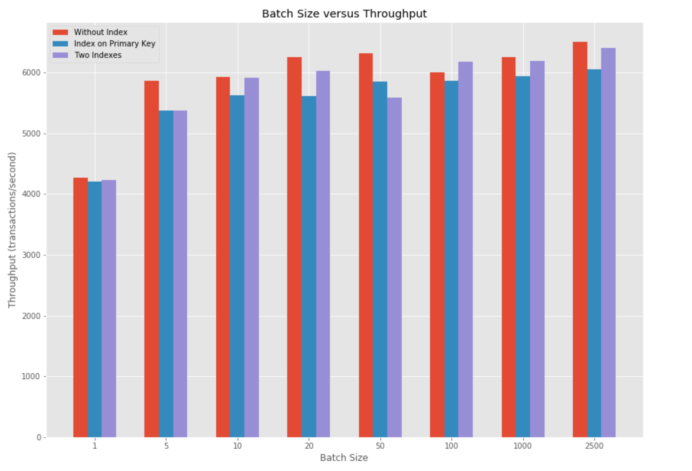
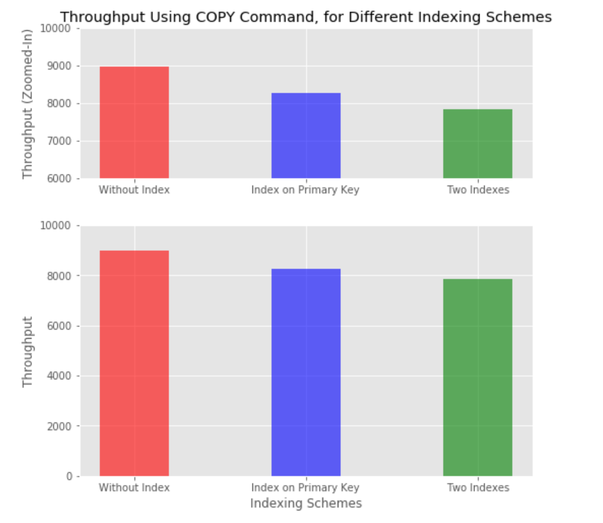
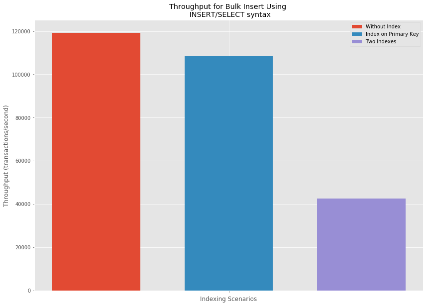

# Performance Experiment: Bulk Ingest

## Abstract

This experiment compares the performance of different methods of bulk insert against the "Digital Music Store" PostgreSQL database under various indexing strategies. First, we analyze the performance of Sequential Inserts. Second, we perform batch inserts and analyze the performance of the batch inserts with respect to number of indexes (primary, secondary, clustered), use of "Insert Into ... Select From" and few other scenarios. The best performance is observed for batch-inserts with INSERT/SELECT and COPY commands.
We find that Batch Insert using INSERT/SELECT syntax with no indexes offers 2.8 times the throughput over inserting records with Two indexes on the table. A similar observation is recorded when using the COPY command during bulk-loading where inserts with no indexes offer 1.15 times the throughput as compared to 2 indexes.

## Hypothesis

#### Description of the conceptual experiment  

The experiment aims to analyze the performance for Bulk Insert on PostgreSQL by using different insertion/indexing mechanisms. There are two key points of comparison, based on which different conditions listed in the next section are designed:  

* Comparing Sequential Inserts with Batch Inserts*  
* Comparing Bulk Insert Performance in the Presence/Absence of Indexes*  

#### Conditions being tested  

Database: Digital Music Store  
Target Table: Track (song details)  
Number of records: 10,000  
Primary Key: TrackId  
Secondary Index Attribute: Name (song name)  

The following conditions were tested and compared as part of the analysis:   
* Inserting records sequentially without the use of any batch insert capabilities.  
* Using standard SQL batch insert statements, and varying batch sizes as: 1, 5, 10, 20, 50, 100, 1000, 2500  
* Creating an index on the primary key and then inserting records with different batch sizes.  
* Creating an additional secondary (non-clustered index) on another attribute of the table, and varying batch sizes for inserts.  
* Using bulk load features of the DBMS ('COPY FROM' command in case of PostgreSQL).  
* Incrementally adding more secondary indexes and performing inserts.  
* Performing bulk inserts by reading from another table, i.e. using the 'INSERT INTO....SELECT FROM' syntax.  

#### Expectations    

* It was expected that inserting records sequentially would result in the lowest throughput among all other scenarios.  
* When using standard SQL batch inserts, we hoped to see a steady increase in throughput with the increase in batch size. However, beyond a certain batch size, we hypothesized that the increase in throughput would stabilize.  
* Although PostgreSQL does not support clustered indexes and requires an explicit 'cluster' action to be performed, we hoped that even creating a non-clustered index on the primary key would bring down the insert performance, and that the effect would be more pronounced for smaller batch sizes.  
* With the addition of a second non-clustered index, it was anticipated that inserts would slow down even further, and keep deteriorating with the addition of more secondary indexes.  
* Use of PostgreSQL native bulk insert functionality using 'COPY FROM' was expected to yield better results than using standard SQL batch inserts.  
* Lastly, by using the 'INSERT INTO...SELECT FROM' syntax, we hoped to achieve the best results across conditions, assuming that it helped the database engine to cut down on the overhead related to parsing and executing multiple insert queries, and simply copy the rows that exist in another table.

## Assumptions and Setup

In our experiment, we used synthetic data that we generated using the [Log-synth](https://github.com/tdunning/log-synth) (Dunning, 2017) tool based on the data-model of [Chinook](https://github.com/lerocha/chinook-database) database (Rocha, 2017). Log-synth is a utility that allows for random data generation based on a schema. There is support for the generation of addresses, dates, foreign key references, unique id numbers, random integers, realistic person names and street names. It is available as a standalone executable, which can be run from the command line.

Chinook data-model represents a digital media store, including tables for artists, albums, media tracks, invoices and customers. *Track* entity was selected for the experiments, which has nine columns – TrackId, Name, AlbumId, MediaTypeId, GenreId, Composer, Milliseconds, Bytes, and UnitPrice.

The database was configured and hosted on cloud as an Amazon RDS (PostgreSQL) instance with [db.t2.micro](https://docs.aws.amazon.com/AmazonRDS/latest/UserGuide/Concepts.DBInstanceClass.html) (1 virtual CPU, 1 GiB of RAM, not EBS-Optimized, and low network performance as compared to other DB instance classes) class (Amazon Web Services, Inc., 2018).

Assumptions:
-	Using Python to connect with the RDS (PostgreSQL) instance and to run the queries with the help of [Psycopg](http://initd.org/psycopg/) library (Varrazzo, 2018) doesn’t have any significant impact on the outlined experiments
-	Impact of network latency is negligible, and ignored

Timings were measured programmatically in Python using the [time](https://docs.python.org/3/library/time.html) module (Python Software Foundation, 2018). Time was recorded before and after the SQL query execution commands and subsequently, the difference was noted. To have greater confidence in the results, we took three readings for execution time, for each test condition and used the average value for our analysis.

## Main Result

* 

## Additional Experiments

### a) Bulk-loading Using COPY Command
**Group Member:** Prateek Tripathi

* The results confirm our hypothesis, that using PostgreSQL specific COPY FROM command for bulk inserts offers considerable performance gains over SQL batch inserts.
* The performance for COPY FROM marginally reduces as the number of indexes are increased.
* However, even in the presence of two indexes, the throughput is 22% more than the highest value observed using regular batch inserts.

### b) Multiple secondary Indexes
**Group Member:** Aakash Agrawal

* Overall, the throughput decreases as the number of indexes increases. However, for 4 indexes the throughput has increased compared to 3 indexes

### c)

### d) Insert records using the INSERT / SELECT syntax  
**Group Member:** Harkar Talwar  

* The above results are in agreement with our hypothesis. 
* Overall, the throughput using INSERT/SELECT is the highest among all other insertion mechanisms. 
* The throughput is however reduced by 9% in the presence of an index on the primary key.
* The presence of a secondary index results in a large 64% drop in throughput for the insert operation. 

## Conclusions and Discussion  

### Fastest Bulk Insert Condition:  
The fastest bulk insert condition was using INSERT INTO...SELECT FROM syntax, with no indexes in place on the target table.

### Reasons for Superior Performance:    
'INSERT INTO...SELECT FROM' operates faster than a normal INSERT command because the data is not read externally, but is rather copied from an existing table to the target table, in a single transaction. Another reason for this result, we argue, could be the absence of a WHERE or JOIN condition, when selecting data from the source table.

### Surprising Findings:  
The results for the main experiment, with different batch sizes, were surprising and some erratic behavior in insert Performance was observed. In some cases, insertion in the presence of two indexes was (marginally) faster than that in the presence of one index, and insertion in the presence of one index was (marginally) faster than that in the absence of indexes.

### Limitations of the Experiment:  
* We were not able to test accurately, scenarios demanding the presence of a clustered index on the primary key. This was because there is limited (indirect) support for clustered indexes in PostgreSQL, and the database does not automatically arrange table data to correlate with the clustered index.
* Some of the surprising results we observed could be due to network latency effects, since the insertions were all performed through a local Python script on a remote AWS hosted database.
* Moreover, the number of rows may not have been considerably large to clearly and consistently observe effects related to indexing. This might have contributed to some of the surprising findings.

### Future Work 
* The analysis was currently performed by comparing insertion of 10,000 rows in different conditions. It would be interesting to see the results when inserting, say, 1 million rows, through each scenario. This could help minimize the inconsistency across different scenarios (no index, one index, and two indexes) and yield repeatable and better interpretable results.
* It would also be worthwhile to explore how the database could be tuned for high throughput on inserts. One of the possible approaches could be to analyze the use of unlogged tables (PostgreSQL uses Write-Ahead Logging by default which incurs additional disk I/O) (Zaiste, 2017). 

### Recommendations to DBAs
* The number of indexes on a table can be a dominant factor for insert performance. Indexes should be used sparingly if inserts are to be optimized.
* Another way to speed up bulk inserts could be to drop indexes temporarily while loading large amounts of data and then rebuilding the indexes, an approach often used in data-warehousing scenarios.
* Although INSERT INTO...SELECT FROM offers the best performance in our case, a complex select query involving joins and filtering could negatively impact the performance of this method.

## References

Amazon Web Services, Inc. (2018). *DB Instance Class*. Retrieved from https://docs.aws.amazon.com/AmazonRDS/latest/UserGuide/Concepts.DBInstanceClass.html

Dunning, T. (2017). *Log-synth*. Retrieved from https://github.com/tdunning/log-synth

Python Software Foundation. (2018). *time — Time access and conversions*. Retrieved from https://docs.python.org/3/library/time.html  

Rocha, L. (2017). *Chinook Database*. Retrieved from https://github.com/lerocha/chinook-database 

Varrazzo, D. (2018). *psycopg*. Retrieved from http://initd.org/psycopg/ 

Winand, M. (n.d.). *Use the Index, Luke. Modifying Data: Inserts.* Retrieved from https://use-the-index-luke.com/sql/dml/inserts

Zaiste (2017). *Faster INSERTs: How to increase PostgreSQL write performance*. Retrieved from https://blog.nukomeet.com/faster-inserts-how-to-increase-postgresql-write-performance-24d76bd56f75