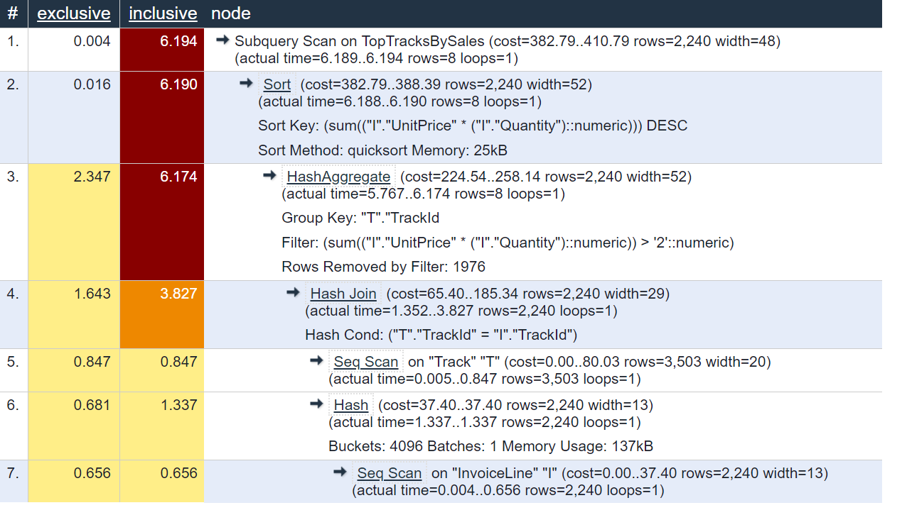

## ER Diagram for Schema

## Three Commonly Accessed Views

### 1. View Involving a JOIN

* Purpose:

*Create View Command:*

*Representative Query:*

*Query Plan:*

*Operations Dominating the Cost:*  

*Algorithm Used for an Expensive Scenario:*

*Selection Condition in the Query Plan*

### 2. View Involving a GROUP-BY

* Purpose: This view allows the business to analyze the customers who bought maximum worth of items in the digital music store, periodically. To get the result, we implement a join between the Customer, Invoice and InvoiceItem tables to view the customers whose purchase value was highest (weekly/monthly/annually)

*Create View Command:*  
```
CREATE VIEW "TopCustomersBySales" AS
SELECT "c"."CustomerId", SUM("UnitPrice" * "Quantity") AS "TotalAmt"
FROM
(SELECT "Customer"."CustomerId", "FirstName", "LastName", "InvoiceId"
	FROM public."Customer"
	JOIN 
	public."Invoice"
	ON public."Customer"."CustomerId" = public."Invoice"."CustomerId") c
	JOIN public."InvoiceLine"
	ON c."InvoiceId" = "InvoiceLine"."InvoiceId"
	GROUP BY "CustomerId"
	ORDER BY "TotalAmt" DESC;
```

*Representative Query:*  
```
-- Show top 50 Customers (here top signifies customers who bought highest worth of items from the store)
EXPLAIN ANALYZE 
SELECT * FROM "TopCustomersBySales" LIMIT 50;  
```

*Query Plan:*  


*Operations Dominating the Cost:*  
*Sorting the records in descending order of the TotalAmt:*  

*GROUPBY Operation on CustomerId:*

*Hash Join based on InvoiceId:*


### 3. View of Our Choice

* Purpose: This view would allow business and end users to analyze the top soundtracks in the digital music store at a given point of time, based on the total sales of each track.

*Create View Command:*  
```
CREATE VIEW "TopTracksBySales" AS
SELECT "T"."Name", SUM("I"."UnitPrice" * "I"."Quantity") AS "TrackSales"
FROM public."Track" "T"
JOIN
public."InvoiceLine" "I"
ON "T"."TrackId" = "I"."TrackId"
GROUP BY "T"."TrackId"
ORDER BY "TrackSales" DESC
```

*Representative Query:*  
```
-- Show top tracks by SALES, only when the sales are more than 2 currency units
EXPLAIN ANALYZE 
SELECT * FROM "TopTracksBySales"
WHERE "TrackSales" > 2  
```

*Query Plan:*  


*Operations Dominating the Cost:*  

*Algorithm Used for an Expensive Scenario:*

*Selection Condition in the Query Plan*
