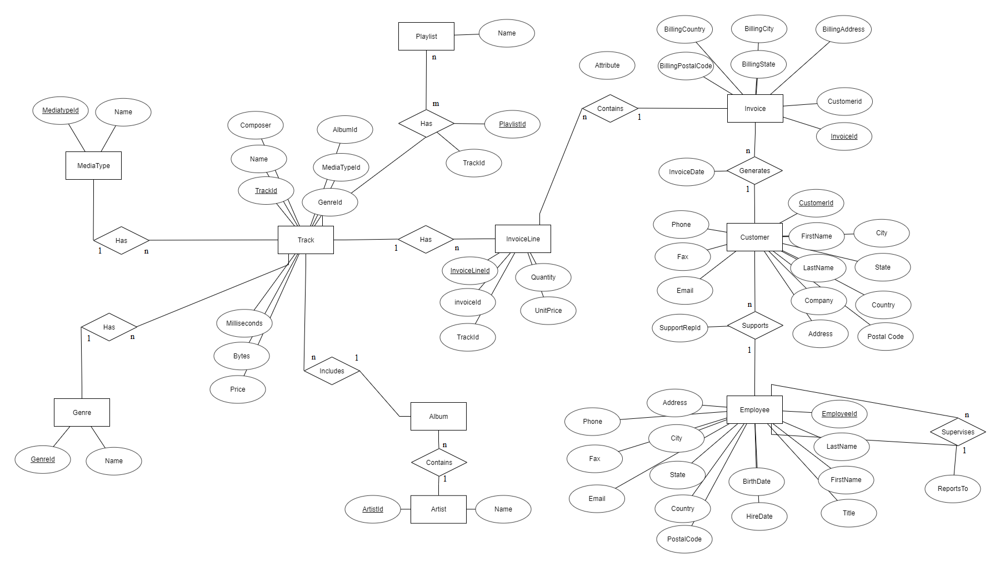
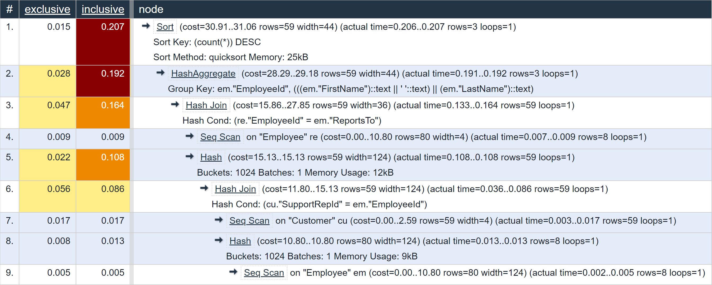
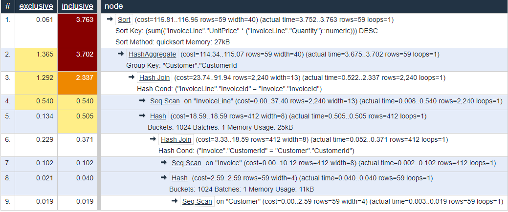

## ER Diagram for Schema



## Three Commonly Accessed Views

### 1. View Involving a JOIN

* Purpose: This view allows the business to analyze the information related to the performance of customer representatives, and understand/manage their respective workloads. We implement a join between the Customer and Employee tables, to see the assigned customer representative for each of the customers.

*Create View Command:*
```
CREATE VIEW customer_relations AS
    SELECT 
        cu."CustomerId" AS "CustomerId",
        cu."FirstName" || ' ' || cu."LastName" AS "FullName",
        cu."Company" AS "Company",
        cu."Address" AS "Address",
        cu."City" AS "City",
        cu."State" || ', ' || cu."Country" AS "Region",
        cu."Phone" AS "Phone",
        cu."Email" AS "Email",
        em."EmployeeId" AS "EmployeeId",
        em."FirstName" || ' ' || em."LastName" AS "Employee",
        em."Title" AS "Title",
        em."City" AS "EmployeeCity",
        em."State" || ', ' || em."Country" AS "EmployeeRegion",
        em."Phone" AS "EmployeePhone",
        em."Email" AS "EmployeeEmail",
        re."ReportsTo" AS "SupervisorId",
        re."FirstName" || ' ' || re."LastName" AS "Supervisor"
    FROM public."Customer" cu
        LEFT JOIN public."Employee" em ON cu."SupportRepId" = em."EmployeeId"
        INNER JOIN public."Employee" re ON em."ReportsTo" = re."EmployeeId";
```

*Representative Query:*
```
-- Display the total number of customers serviced by each employee.
EXPLAIN ANALYZE
SELECT 
	"EmployeeId",
	"Employee",
	COUNT(*) AS "NumberOfCustomersRepresented"	
FROM customer_relations
GROUP BY "EmployeeId", "Employee"
ORDER BY "NumberOfCustomersRepresented" DESC;
```

*Query Plan:*



*Planning time: 0.247 ms*

*Execution time: 0.276 ms*

*Note: 'Exclusive' denotes time taken for execution, for that particular node. 'Inclusive' denotes the total time taken from the bottom of the tree to a node.*

*Operations Dominating the Cost:*
As it can be seen from the query plan above, the operations dominating the cost (indicated by the exclusive time column) are:    
1. Join - The join between the Customer and Employee tables is the most expensive operation performed as denoted by the 'Hash Join' node (0.056 ms), followed by the Employee table self join as denoted by the 'Hash Join' node (0.047 ms).
2. Aggregation - The third most expensive operation is the aggregation operation performed by the 'HashAggregate' node (0.028 ms), where we group the table by "EmployeeId" and name of the employee.

*Algorithm Used for an Expensive Scenario:*
We observe that 'Hash Join' is the algorithm used for performing the join between the Customer and Employee tables and the Employee table self join. This requires the creation of an in-memory hash table in which the rows of one table are entered. This operation is followed by the scan operation on the other table, where the hash table is probed for matches to each row.

*Selection Condition in the Query Plan:*
The selection condition was not pushed to the leaves in the query. Rather, it was performed as part of the aggregation operation. This is because in order for the sorting to be done, the aggregated column, 'NumberOfCustomersRepresented' was required to be computed. Therefore the optimizer, chose to apply the selection as part of the aggregation (HashAggregate) operation. Although, we could say that it was pushed to the leaf if we consider the nodes below the 'HashAggregate" node as part of the creation of the customer_relation view.

### 2. View Involving a GROUP-BY

* Purpose: This view allows the business to analyze the customers who bought maximum worth of items in the digital music store, periodically. To get the result, we implement a join between the Customer, Invoice and InvoiceItem tables to view the customers whose purchase value was highest (weekly/monthly/annually)

*Create View Command:*  
```
CREATE VIEW "TopCustomersBySales" AS
SELECT "c"."CustomerId", SUM("UnitPrice" * "Quantity") AS "TotalAmt"
FROM
(SELECT "Customer"."CustomerId", "FirstName", "LastName", "InvoiceId"
	FROM public."Customer"
	JOIN 
	public."Invoice"
	ON public."Customer"."CustomerId" = public."Invoice"."CustomerId") c
	JOIN public."InvoiceLine"
	ON c."InvoiceId" = "InvoiceLine"."InvoiceId"
	GROUP BY "CustomerId"
	ORDER BY "TotalAmt" DESC;
```

*Representative Query:*  
```
-- Show top 50 Customers (here top signifies customers who bought highest worth of items from the store)
EXPLAIN ANALYZE 
SELECT * FROM "TopCustomersBySales" LIMIT 50;  
```

*Query Plan:*  


- "Planning time: 0.504 ms"

- "Execution time: 3.855 ms"

*Operations Dominating the Cost:*  
- As seen in the table, we see that two operations dominate the total cost, the first is the GROUPBY operation to group all of a customer's transactions together based on CustomerId, and second is the JOIN operatioon based on InvoiceID. The first operation take a total of 1.365ms out of the total 3.855 ms, and the second takes 1.282 ms.

*Algorithm Used for an Expensive Scenario:*  
Aggregation - The aggregation (GROUP BY) was performed using the HashAggregate algorithm. This algorithm involves iterating over each row, finding the GROUP key, CustomerId in this case, and assigning the row to a bucket corresponding to the CustomerId in a hash-table. The algorithm scans the hash-table and returns a row per key, while performing the required aggregation (sum in this case). The second most expensive operation was the JOIN between InvoiceLine and Invoice tables, performed using the HASH Join method. In this method, rows of one table are entered into an in-memory hash table, after which the other table is scanned and the hash table is probed for matches to each row.   

*Selection Condition in the Query Plan:*  
The selection condition was not pushed to the leaves in the query, but was performed as part of the aggregation operation. In order for the sorting to be done, the aggregated column, 'TotalAmt' was required. Therefore the optimizer, chose to apply this selection and grouping as part of the HashAggregate operation.

### 3. View of Our Choice

* Purpose: This view would allow business and end users to analyze the top soundtracks in the digital music store at a given point of time, based on the total sales of each track.

*Create View Command:*  
```
CREATE VIEW "TopTracksBySales" AS
SELECT "T"."Name", SUM("I"."UnitPrice" * "I"."Quantity") AS "TrackSales"
FROM public."Track" "T"
JOIN
public."InvoiceLine" "I"
ON "T"."TrackId" = "I"."TrackId"
GROUP BY "T"."TrackId"
ORDER BY "TrackSales" DESC
```

*Representative Query:*  
```
-- Show top tracks by SALES, only when the sales are more than 2 currency units
EXPLAIN ANALYZE 
SELECT * FROM "TopTracksBySales"
WHERE "TrackSales" > 2  
```

*Query Plan:*  


*Planning time: 0.212 ms*

*Execution time: 6.250 ms*

*Note: 'Exclusive' denotes time taken for execution, for that particular node. 'Inclusive' denotes the total time taken from the bottom of the tree to a node.*

*Operations Dominating the Cost:*    
As it can be seen from the query plan above, the operations dominating the cost (indicated by the exclusive time column) are:    
1. Aggregation - Grouping by track ID to find the top selling tracks was the most expensive operation, as per the query plan. This operation is depicted in the node with the 'HashAggregate' operator, taking 2.3 ms out of the total ~6.2 ms required for the query.  
2. Join - The join between the Track and InvoiceLine tables is the second most expensive operation. It is denoted by the node with the 'HashJoin' operator. The operation required 1.6 ms.  

*Algorithm Used for an Expensive Scenario:*  
Aggregation - The aggregation (GROUP BY) was performed by using the HashAggregate algorithm. This algorithm involves iterating over each row, finding the GROUP-BY key, TrackId in this case, and assigning the row to a bucket corresponding to the TrackId in a hash-table. After processing all rows in this manner, the algorithm scans the hash-table and returns a single row for each key, while performing the required aggregation (sum in this case). Since the algorithm has to scan the entire table before it can return even a single row, this is an expensive operation.

*Selection Condition in the Query Plan:*  
The selection condition was not pushed to the leaves in the query. Rather, it was performed as part of the aggregation operation. This is because in order for the filtering to be done, the aggregated column, 'TrackSales' was required to be computed. Therefore the optimizer, chose to apply this selection as part of the aggregation (HashAggregate) operation.


* To visualize the query plan we used the following resource : https://explain.depesz.com/
